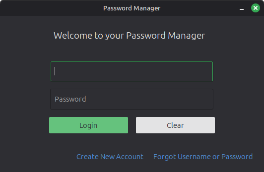
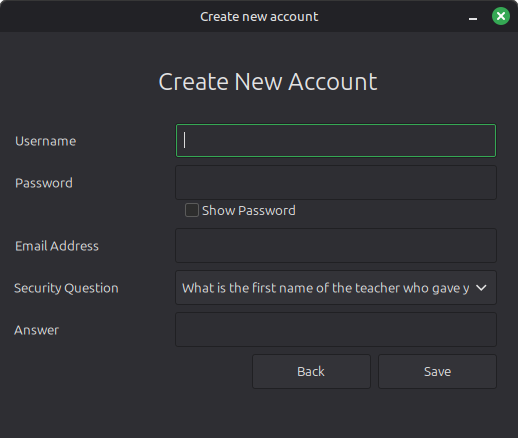
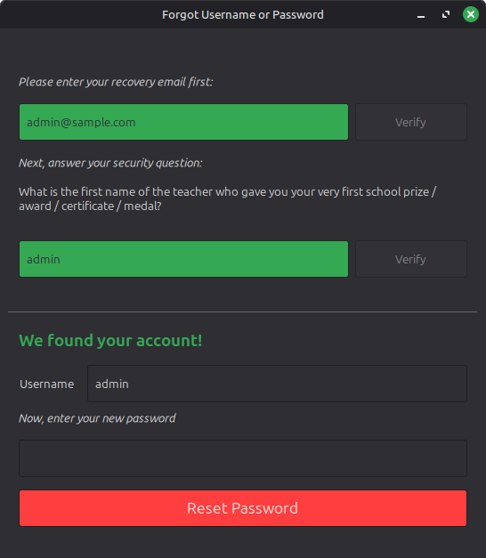
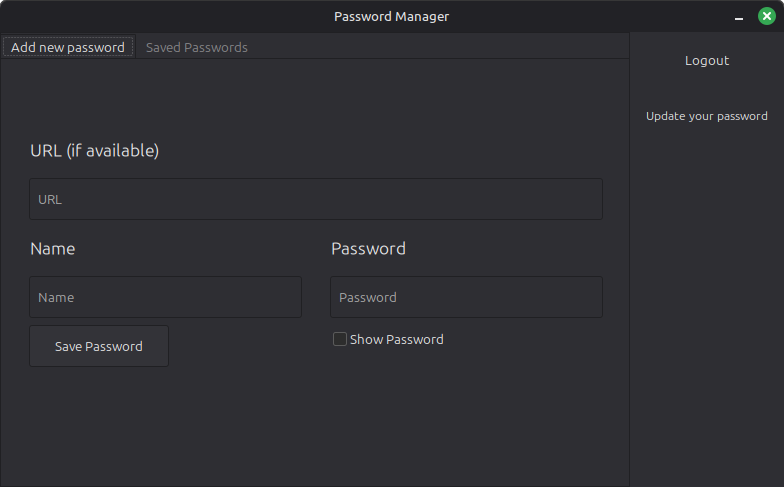
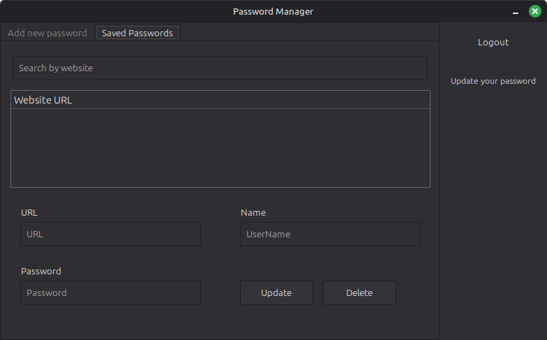
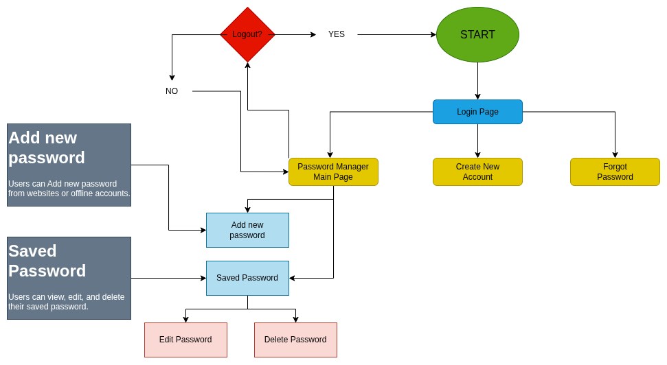
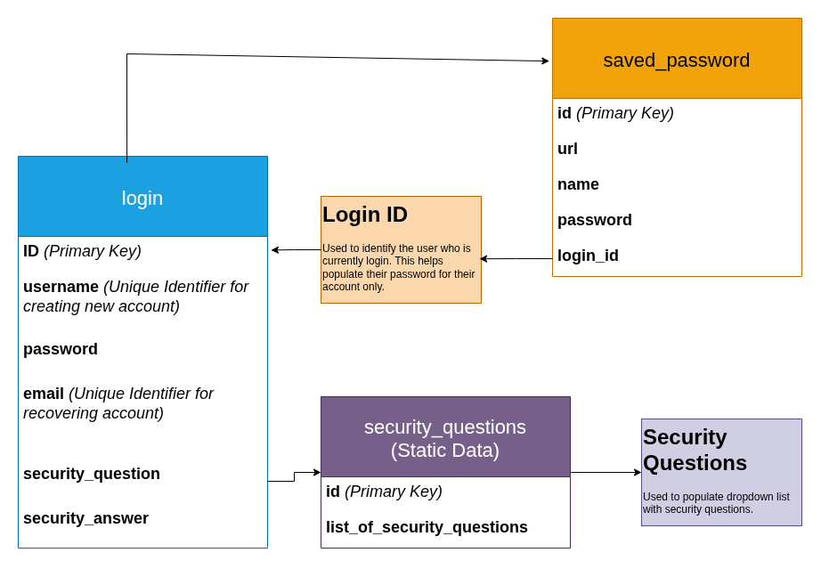

# Password Manager (Gambas)

A secure, offline password manager built with Gambas3 and SQLite.

## Features

- **Secure Login:** User account creation with security question recovery.
- **CRUD Operations:** Create, Read, Update, and Delete saved passwords.
- **Search:** Real-time filtering of saved accounts.
- **Data Privacy:** Local SQLite database storage.

## Screenshots

### Login Page

### Password Manager Dashboard

## Flowchart

## Tech Stack
 

## Installation

1. Install Gambas3: `sudo apt-get install gambas3`
2. Clone the repo: `git clone https://github.com/bray-hiramis/password-manager.git`
3. Open the project in Gambas IDE and run.

## License

Distributed under the MIT License. See `LICENSE` for more information.

## Author

<strong>Bray Hiramis</strong> [github.com/bray-hiramis](github.com/bray-hiramis)